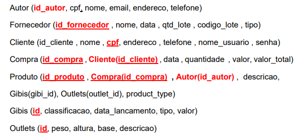
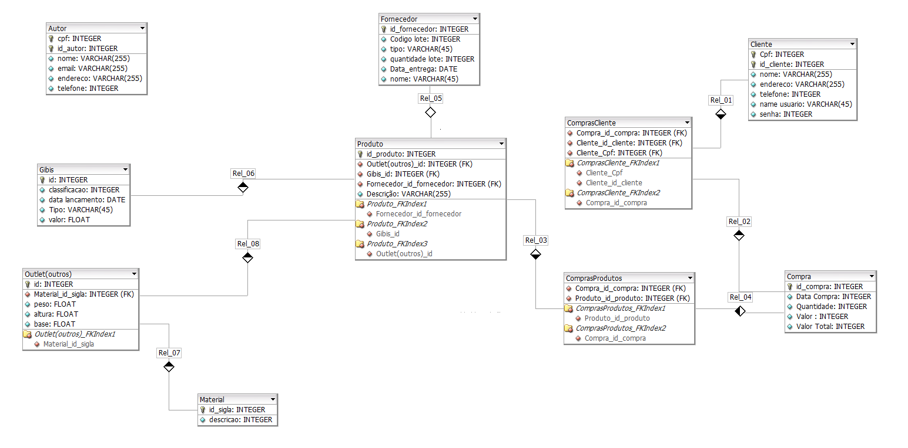

## Relational Logical Model

We can see the code below the relational model.

 

To simplify better, we have the graphic part in image to visualize the project as a whole.

 

## references

[Modeling Polymorphic Associations in a Relational Database](https://hashrocket.com/blog/posts/modeling-polymorphic-associations-in-a-relational-database)
